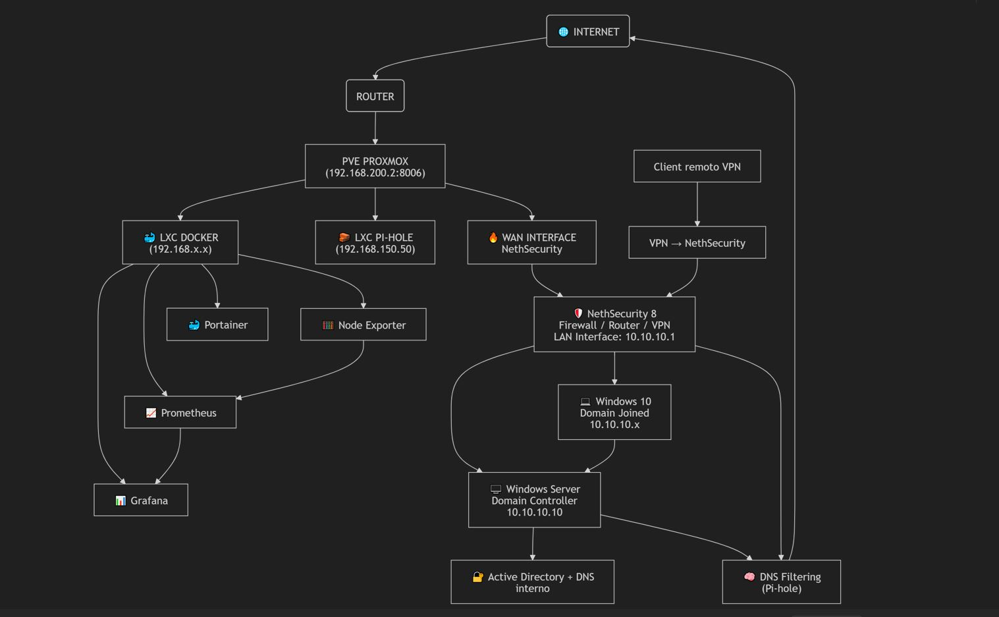

# Proxmox-lab
Proxmox lab with Enterprise Network, Docker, AD, monitoring, firewall

# 🖥️ Infrastructure Proxmox

This project documents my personal project built to practice system administration, networking, and infrastructure design.

##  Overview

The lab is based on Proxmox VE and includes:

- Virtual machines with internal LAN and LXC containers
- Network segmentation (WAN / LAN / DMZ)
- Active Directory domain
- Centralized DNS with Pi-hole
- Docker-based services
- Reverse proxy with Nginx Proxy Manager
- Monitoring stack (Prometheus + Grafana)
- VPN access for secure remote management

---

##  Architecture

---

## 🌐 Network Design

- **WAN**: 192.168.x.x (home network)
- **LAN**: 10.10.10.x (internal domain network)
- **DMZ**: 10.10.20.x (isolated services)

## Traffic flow:

- Client → Domain Controller → Pi-hole → Internet

---

##  Infrastructure Components

### Virtualization
- Proxmox VE host
- LXC containers (Docker, Pi-hole)
- VMs (Windows Server, Windows 10, NethSecurity8)

### Networking
- Firewall: NethSecurity
- DHCP: NethSecurity
- DNS chain:
  - Windows Server (AD DNS)
  - Pi-hole (filtering + upstream)

### Services
- Docker stack:
  - Grafana
  - Prometheus
  - Portainer
  - Nextcloud

### Reverse Proxy
- Nginx Proxy Manager
- Internal domains:
  - grafana.home
  - nextcloud.home

### Monitoring
- Prometheus (metrics collection)
- Node Exporter (host metrics)
- Grafana (visualization)

---

## 🔐 Security

- Network segmentation (LAN / DMZ / WAN)
- Firewall rules controlling traffic flow
- VPN access for remote administration
- No direct exposure of internal services

---

##  Learning Goals

- Network segmentation and routing
- DNS architecture and resolution flow
- Container networking (Docker)
- Reverse proxy configuration
- Monitoring and observability
- Troubleshooting multi-layer systems

---

## 📌 Future Improvements

- Proxmox Backup Server integration
- DMZ expansion (reverse proxy + public services)
- SSO authentication
- High availability setup

---

## 📄 Author

Personal project for learning System Administration and Networking.

