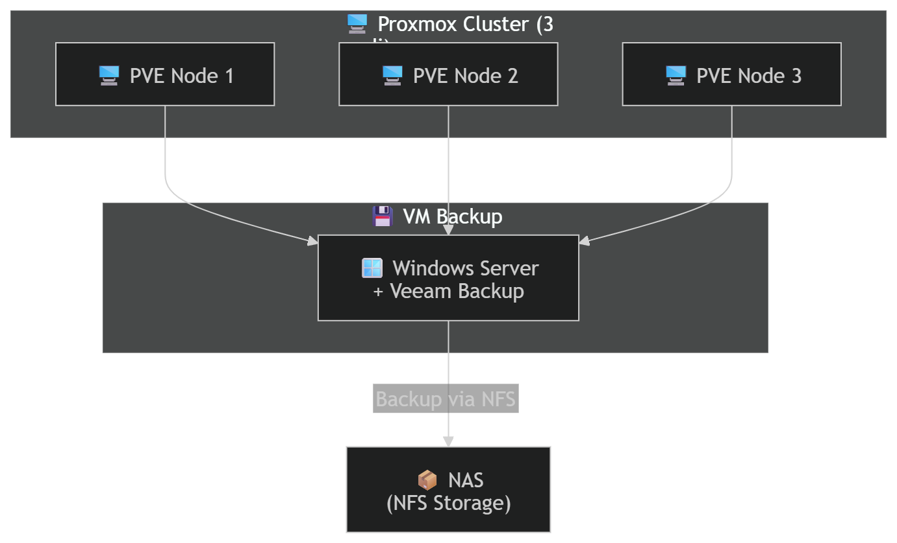

# 🖥️ Proxmox Cluster Lab with High Availability and Backup

This project documents a multi-node virtualization infrastructure built to practice real-world system administration concepts including clustering, high availability, shared storage, and disaster recovery.

---

## 🚀 Overview

The lab is based on a 3-node cluster using Proxmox VE and includes:

- Multi-node cluster with quorum
- Shared storage (NFS NAS)
- High Availability (HA)
- VM failover testing
- Backup and recovery using Veeam

---

## 🏗️ Architecture

- 3 Proxmox nodes
- NAS providing NFS shared storage
- Windows Server with Veeam Backup & Replication

---

## 🌐 Infrastructure Components

### Virtualization
- Proxmox VE cluster (3 nodes)

### Storage
- Shared storage via NFS (NAS)
- VM disks migrated from local storage to shared storage

### High Availability
- HA configured for selected virtual machines
- Automatic failover enabled across nodes

### Backup
- Veeam Backup & Replication deployed on Windows Server
- Backup repository hosted on NAS (NFS)

---

## 🔄 Workflow Implemented

### 1. Cluster Setup
- Created cluster from primary node
- Joined additional nodes
- Verified quorum and cluster health

### 2. Shared Storage
- Configured NFS storage accessible from all nodes
- Migrated VM disks from local storage to NFS

### 3. High Availability
- Enabled HA for critical VMs
- Configured VM restart policies

### 4. Backup Strategy
- Created backup repository on NAS
- Configured backup jobs using Veeam

### 5. Disaster Recovery Testing
- Backed up VM originally stored on local storage
- Restored entire VM on a different Proxmox node
- Verified successful cross-node recovery

---

## 🔥 Failover Test

Simulated node failure:

1. VM running on node A
2. Node A powered off
3. HA triggered automatic restart on node B

---

## 💾 Backup & Restore Test

- Backup performed using Veeam
- Full VM restore executed on a different node
- Verified functionality after restore

---

## 🧠 Key Concepts Learned

- Cluster quorum and node management
- Shared storage vs local storage
- High Availability vs Backup
- VM failover behavior
- Disaster recovery strategies
- Cross-node restoration

---

## 📌 Future Improvements

- Separate storage network
- Backup monitoring and alerting
- Incremental backup optimization
- Advanced HA rules (affinity/anti-affinity)

---

## 📄 Author

Personal lab project focused on system administration, virtualization, and infrastructure design.
